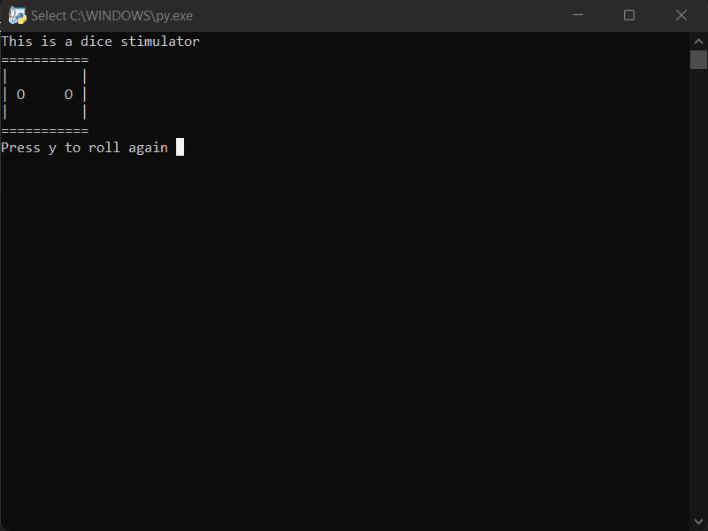

[](https://github.com/shubhammauryainfo)


# Dice Rolling Stimulator
<p align="center">


## 🛠️ Description

This is a simple dice stimulator made using Python.


## ⚙️ Languages or Frameworks Used
You only need Python to run this script. You can visit [here](https://www.python.org/downloads/) to download Python.

## 🌟 How to run

Running the script is really simple! Just open a terminal in the folder where your script is located and run the following command:

```sh
python dice_stimulator.py
```

## 📺 Demo
<p align="center">


