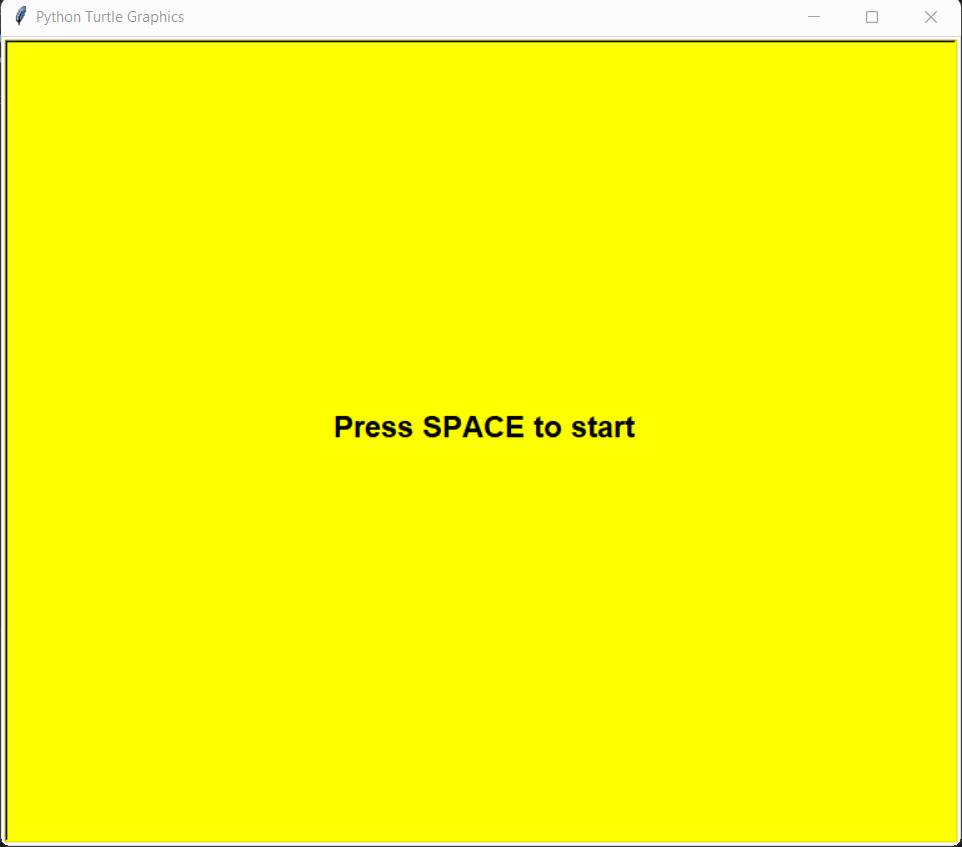

[](https://github.com/shubhammauryainfo)


# Caterpillar
<p align="center">


## 🛠️ Description

A simple Caterpillar game built in python.

## ⚙️ Languages or Frameworks Used
```bash
pip install turtle
```

## 🌟 How to run
Running the script is really simple! Just open a terminal in the folder where your script is located and run the following command:

```sh
python Caterpillar.py
```
## 📺 Demo
<p align="center">


